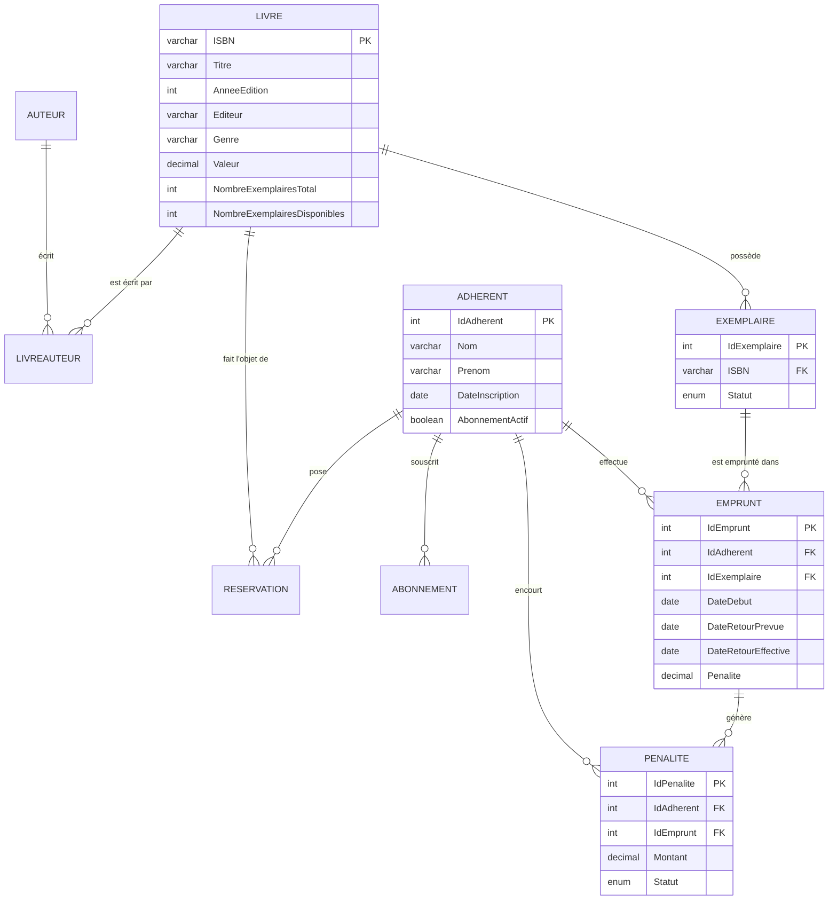

# Système de gestion de bibliothèque — Modélisation et implémentation SQL

Conception et implémentation d'une base de données MySQL 8 pour une bibliothèque privée fonctionnant sur abonnement : **9 tables**, **10 contraintes d'intégrité référentielle**, **8 déclencheurs** et **3 procédures stockées transactionnelles**.

Le parti pris du projet : faire porter les contrôles métier essentiels par la base elle-même. Les compteurs d'exemplaires, les emprunts, les pénalités et la file des réservations sont contrôlés par des déclencheurs et des procédures stockées.

---

## Contexte

Devoir de **Bases de Données Avancées**, ENSEA Abidjan, niveau AS3 option Data Science, année académique 2024-2025.

L'énoncé décrivait *BiblioTecho*, une bibliothèque privée indépendante de toute institution publique, fonctionnant sur abonnement, souhaitant informatiser sa gestion documentaire et administrative : ouvrages, auteurs, adhérents, emprunts, retours, réservations et pénalités.

## Modèle de données



**Le choix de modélisation structurant** est la séparation entre `Livre` (l'œuvre, identifiée par son ISBN) et `Exemplaire` (la copie physique, avec son propre statut). Sans cette distinction, il serait impossible de savoir quelle copie précise est empruntée ni de gérer plusieurs emprunts simultanés d'un même titre. La relation `LivreAuteur` gère quant à elle les ouvrages à plusieurs auteurs par une clé primaire composée.

Le moteur **InnoDB** a été retenu pour l'ensemble des tables, seul moteur MySQL supportant les transactions et les contraintes de clés étrangères — indispensable ici puisque le calcul des pénalités doit être atomique.

## Logique métier implémentée

**Huit déclencheurs** maintiennent la cohérence automatiquement :

| Règle métier | Mécanisme |
|---|---|
| Compteurs d'exemplaires toujours justes | Déclencheurs sur insertion et suppression d'`Exemplaire`, mise à jour de `NombreExemplairesTotal` et `NombreExemplairesDisponibles` |
| Un emprunt rend l'exemplaire indisponible | Déclencheurs sur `Emprunt`, passage du statut à « Emprunté » et décrément du compteur |
| Plafond d'emprunts simultanés par adhérent | Déclencheur de contrôle avant insertion |
| Abonnement actif, exemplaire disponible et durée maximale de 15 jours | Contrôles avant insertion d'un emprunt |
| Unicité de l'emprunt d'un exemplaire | Déclencheur bloquant un second emprunt d'une copie déjà sortie |
| Blocage des adhérents à pénalités impayées | Déclencheur vérifiant l'absence de pénalité en attente avant tout nouvel emprunt |
| Abonnement actif, existence d'exemplaires et quota de réservations | Déclencheur avant insertion d'une réservation |

**Trois procédures stockées** encapsulent les opérations complexes :

`enregistrer_retour` est la plus aboutie. Elle ouvre une transaction, calcule le retard par différence de dates, applique le barème de 500 FCFA par jour, met à jour l'emprunt et crée la pénalité le cas échéant. Un gestionnaire d'exception `EXIT HANDLER FOR SQLEXCEPTION` déclenche un `ROLLBACK` puis relaie l'erreur par `RESIGNAL` — la base ne peut donc jamais se retrouver dans un état où le retour serait enregistré sans sa pénalité, ou l'inverse.

`supprimer_exemplaire_egare` traite la perte d'une copie prêtée à l'adhérent indiqué : elle crée la pénalité à hauteur de la valeur du livre, clôt l'emprunt et conserve la copie avec le statut `Perdu` pour préserver l'historique. `traiter_reservations_expirees` transfère la notification à la prochaine réservation chronologique avant de supprimer la réservation arrivée à échéance.

## Règles retenues

Le sujet présente une ambiguïté sur les réservations : il les autorise lorsqu'un livre n'a plus de copie disponible, mais indique aussi qu'il faut au moins un exemplaire. Le projet interprète cette règle comme « au moins une copie physique existe », même si toutes les copies sont empruntées.

Une perte est rattachée à un emprunt actif du même adhérent. La copie n'est pas supprimée de la base : elle passe au statut `Perdu`, et le total des copies disponibles est ajusté. Les abonnements de démonstration couvrent le mois courant; les dates des exemples d'emprunt sont relatives à `CURDATE()` pour que les tests restent valides.

## Contenu du dépôt

```
sql/01_schema_triggers_procedures.sql   Script de référence — schéma, déclencheurs,
                                        procédures et données synthétiques de démonstration
sql/02_export_mysql_complet.sql         Snapshot phpMyAdmin historique, à titre de comparaison
sql/03_schema_workbench.sql             Export de structure MySQL Workbench
docs/dictionnaire_donnees.xlsx          Dictionnaire des données : table, colonne, type,
                                        contrainte et description de chaque champ
docs/modele_conceptuel.mwb              Modèle MySQL Workbench (ouvrable dans l'outil)
docs/Devoir_BDA_AS3.pdf                 Énoncé du devoir (inclus pour référence)
```

## Reproduire la base

```bash
git clone https://github.com/abdoul4Kone/library-management-sql.git
cd library-management-sql
mysql -u <utilisateur> -p < sql/01_schema_triggers_procedures.sql
```

Utiliser MySQL 8.0 et une base vide. Le script crée le schéma `bibliotecho`, les objets SQL et des données synthétiques permettant de tester les contrôles, cinq retours, six réservations et deux pertes. Il ne doit pas être relancé sur une base déjà créée : les tables, procédures et déclencheurs ne sont pas tous déclarés `IF NOT EXISTS`.

## Limites et pistes d'amélioration

Des index métier sur les titres, les genres ou les noms d'adhérents pourraient être ajoutés selon les requêtes et volumes réels; les clés étrangères et leurs index ne remplacent pas ces index de recherche.

`02_export_mysql_complet.sql` est un export phpMyAdmin ancien, conservé comme snapshot historique. Utiliser `01_schema_triggers_procedures.sql` pour créer la base de démonstration.

Le barème des pénalités (500 FCFA par jour) et le montant d'abonnement (5 000 FCFA) sont **codés en dur**. La dépréciation annuelle de la valeur des livres mentionnée dans le sujet n'est pas automatisée; une règle métier et une procédure planifiée restent à définir.

Aucune **vue** n'a été créée. Des vues sur les emprunts en cours, les retards ou la disponibilité par titre simplifieraient l'exploitation courante.

## Outils

MySQL (InnoDB) · MySQL Workbench (modélisation conceptuelle) · phpMyAdmin · SQL procédural : déclencheurs, procédures stockées, transactions, gestion d'exceptions

---

## Équipe et contribution

Projet réalisé en binôme dans le cadre du cursus ENSEA.

**KONE Abdoulaye** · KONE Mouhammad

> Projet académique réalisé à des fins pédagogiques. Le PDF de l'énoncé est inclus dans `docs/` pour référence; sa publication est autorisée par l'équipe du projet.

**Abdoulaye KONE** — Analyste Statisticien, diplômé de l'Ecole Nationale Supérieure de Statistique et Economie Appliquée (ENSEA d'Abidjan)
[LinkedIn](https://linkedin.com/in/abdoulaye-kone)
