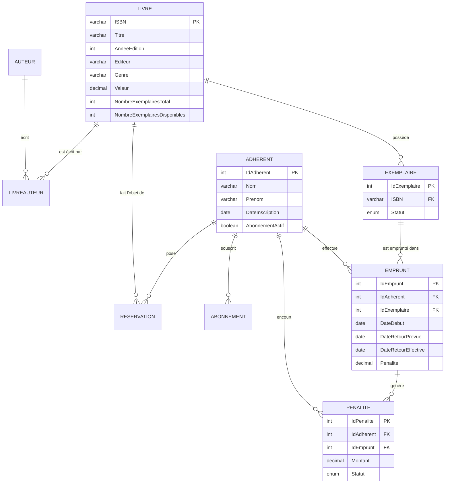

# Système de gestion de bibliothèque — Modélisation et implémentation SQL

Conception et implémentation complète d'une base de données MySQL pour une bibliothèque privée fonctionnant sur abonnement : **9 tables**, **10 contraintes d'intégrité référentielle**, **7 déclencheurs** et **3 procédures stockées transactionnelles**.

Le parti pris du projet : faire porter la logique métier par la base elle-même plutôt que par l'application. Les compteurs d'exemplaires, le calcul des pénalités de retard et l'expiration des réservations sont gérés par des déclencheurs et des procédures, ce qui garantit la cohérence des données quelle que soit l'application cliente.

---

## Contexte

Devoir de **Bases de Données Avancées**, ENSEA Abidjan, niveau AS3 option Data Science, année académique 2024-2025.

L'énoncé décrivait *BiblioTecho*, une bibliothèque privée indépendante de toute institution publique, fonctionnant sur abonnement, souhaitant informatiser sa gestion documentaire et administrative : ouvrages, auteurs, adhérents, emprunts, retours, réservations et pénalités.

## Modèle de données



**Le choix de modélisation structurant** est la séparation entre `Livre` (l'œuvre, identifiée par son ISBN) et `Exemplaire` (la copie physique, avec son propre statut). Sans cette distinction, il serait impossible de savoir quelle copie précise est empruntée ni de gérer plusieurs emprunts simultanés d'un même titre. La relation `LivreAuteur` gère quant à elle les ouvrages à plusieurs auteurs par une clé primaire composée.

Le moteur **InnoDB** a été retenu pour l'ensemble des tables, seul moteur MySQL supportant les transactions et les contraintes de clés étrangères — indispensable ici puisque le calcul des pénalités doit être atomique.

## Logique métier implémentée

**Sept déclencheurs** maintiennent la cohérence automatiquement :

| Règle métier | Mécanisme |
|---|---|
| Compteurs d'exemplaires toujours justes | Déclencheurs sur insertion et suppression d'`Exemplaire`, mise à jour de `NombreExemplairesTotal` et `NombreExemplairesDisponibles` |
| Un emprunt rend l'exemplaire indisponible | Déclencheurs sur `Emprunt`, passage du statut à « Emprunté » et décrément du compteur |
| Plafond d'emprunts simultanés par adhérent | Déclencheur de contrôle avant insertion |
| Unicité de l'emprunt d'un exemplaire | Déclencheur bloquant un second emprunt d'une copie déjà sortie |
| Blocage des adhérents à pénalités impayées | Déclencheur vérifiant l'absence de pénalité en attente avant tout nouvel emprunt |

**Trois procédures stockées** encapsulent les opérations complexes :

`enregistrer_retour` est la plus aboutie. Elle ouvre une transaction, calcule le retard par différence de dates, applique le barème de 500 FCFA par jour, met à jour l'emprunt et crée la pénalité le cas échéant. Un gestionnaire d'exception `EXIT HANDLER FOR SQLEXCEPTION` déclenche un `ROLLBACK` puis relaie l'erreur par `RESIGNAL` — la base ne peut donc jamais se retrouver dans un état où le retour serait enregistré sans sa pénalité, ou l'inverse.

`supprimer_exemplaire_egare` traite la perte d'un exemplaire en facturant sa valeur à l'adhérent. `traiter_reservations_expirees` bascule en lot les réservations dont la date limite de récupération est dépassée.

## Contenu du dépôt

```
sql/01_schema_triggers_procedures.sql   Script principal — création des tables, déclencheurs,
                                        procédures et jeu de données de test (605 lignes)
sql/02_export_mysql_complet.sql         Export phpMyAdmin de la base opérationnelle
sql/03_schema_workbench.sql             Script généré par MySQL Workbench (structure seule)
docs/dictionnaire_donnees.xlsx          Dictionnaire des données : table, colonne, type,
                                        contrainte et description de chaque champ
docs/modele_conceptuel.mwb              Modèle MySQL Workbench (ouvrable dans l'outil)
```

## Reproduire la base

```bash
git clone https://github.com/abdoul4Kone/library-management-sql.git
cd library-management-sql
mysql -u <utilisateur> -p < sql/01_schema_triggers_procedures.sql
```

Le script crée la structure complète et insère un jeu de données de test permettant d'exercer immédiatement les déclencheurs et les procédures.

## Limites et pistes d'amélioration

Aucun **index secondaire** n'a été défini au-delà des clés primaires et étrangères. Sur un volume réel, les recherches par titre, par genre ou par nom d'adhérent nécessiteraient des index dédiés.

L'export `02_export_mysql_complet.sql` conserve les clauses `DEFINER=root@localhost` générées par phpMyAdmin. Elles devront être adaptées ou retirées pour un déploiement sur un autre serveur.

Le barème des pénalités (500 FCFA par jour) et le montant d'abonnement (5 000 FCFA) sont **codés en dur** dans les procédures et les valeurs par défaut. Une table de paramétrage permettrait de les faire évoluer sans modifier le code.

Aucune **vue** n'a été créée. Des vues sur les emprunts en cours, les retards ou la disponibilité par titre simplifieraient l'exploitation courante.

## Outils

MySQL (InnoDB) · MySQL Workbench (modélisation conceptuelle) · phpMyAdmin · SQL procédural : déclencheurs, procédures stockées, transactions, gestion d'exceptions

---

## Équipe et contribution

Projet réalisé en binôme dans le cadre du cursus ENSEA.

**KONE Abdoulaye** · KONE Mouhammad

> Projet académique réalisé à des fins pédagogiques. L'énoncé original du devoir, propriété de l'ENSEA, n'est pas reproduit dans ce dépôt.

**Abdoulaye KONE** — Analyste Statisticien, diplômé de l'Ecole Nationale Supérieure de Statistique et Economie Appliquée (ENSEA d'Abidjan)
[LinkedIn](https://linkedin.com/in/abdoulaye-kone)
